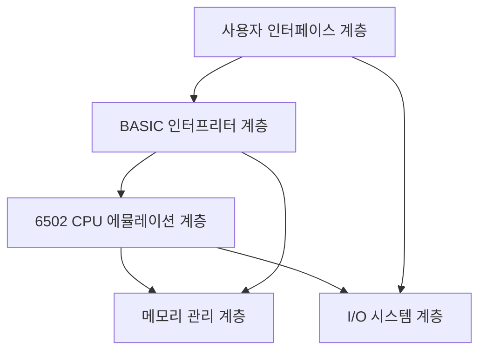

# 개발자 가이드

> 6502 BASIC JavaScript 에뮬레이터 개발 환경 설정 및 아키텍처 가이드

## 📋 목차

1. [개발 환경 설정](#개발-환경-설정)
2. [프로젝트 아키텍처](#프로젝트-아키텍처)
3. [개발 워크플로우](#개발-워크플로우)
4. [코딩 규칙](#코딩-규칙)
5. [디버깅 가이드](#디버깅-가이드)
6. [성능 최적화](#성능-최적화)
7. [트러블슈팅](#트러블슈팅)

## 🚀 개발 환경 설정

### 필요 조건

- **Bun** 1.0.0 이상 - JavaScript/TypeScript 런타임
- **Node.js** 18.0.0 이상 (선택적)
- **Git** 2.20.0 이상
- **현대적 코드 에디터** (VS Code 권장)

### VS Code 확장 프로그램 (권장)

```json
{
  "recommendations": [
    "esbenp.prettier-vscode",
    "bradlc.vscode-tailwindcss",
    "ms-vscode.vscode-typescript-next",
    "formulahendry.auto-rename-tag",
    "christian-kohler.path-intellisense",
    "ms-vscode.test-adapter-converter"
  ]
}
```

### 프로젝트 클론 및 설정

```bash
# 저장소 클론
git clone https://github.com/your-username/6502-basic-js.git
cd 6502-basic-js/jsbasic

# 의존성 설치
bun install

# 개발 환경 확인
bun run lint    # TypeScript 타입 검사
bun run test    # 모든 테스트 실행
bun run dev     # 개발 서버 시작
```

### 환경 변수 설정

`.env` 파일 생성:

```bash
# 개발 환경 설정
NODE_ENV=development
DEV_SERVER_PORT=3000
DEBUG_MODE=true

# 빌드 설정
BUILD_ANALYZER=false
MINIFY=false

# 테스트 설정
TEST_TIMEOUT=10000
COVERAGE_THRESHOLD=90
```

## 🏗️ 프로젝트 아키텍처

### 계층별 아키텍처



### 모듈 의존성 그래프

```
src/
├── index.ts           # 메인 엔트리 포인트
├── types/             # 공통 타입 정의
├── utils/             # 공통 유틸리티
├── cpu/               # CPU 에뮬레이터
│   ├── cpu.ts         # CPU 클래스 (코어)
│   ├── instructions.ts # 명령어 구현
│   ├── addressing.ts  # 주소 지정 모드
│   └── opcodes.ts     # 오피코드 테이블
├── memory/            # 메모리 관리
│   ├── memory.ts      # 메모리 매니저
│   ├── heap.ts        # 힙 관리
│   └── garbage.ts     # 가비지 컬렉터
├── basic/             # BASIC 인터프리터
│   ├── parser.ts      # 구문 분석기
│   ├── interpreter.ts # 실행 엔진
│   ├── variables.ts   # 변수 관리
│   ├── functions.ts   # 내장 함수
│   └── statements.ts  # 명령문 처리
├── math/              # 수학 패키지
│   ├── float.ts       # 부동소수점
│   ├── trig.ts        # 삼각함수
│   └── utils.ts       # 수학 유틸리티
├── io/                # 입출력 시스템
│   ├── terminal.ts    # 터미널 인터페이스
│   ├── keyboard.ts    # 키보드 처리
│   └── storage.ts     # 파일 저장/로드
└── ui/                # 사용자 인터페이스
    ├── editor.ts      # 코드 에디터
    ├── console.ts     # 콘솔 창
    └── controls.ts    # 제어 버튼
```

### TypeScript 타입 시스템

#### 핵심 인터페이스

```typescript
// CPU 레지스터 타입
interface CPURegisters {
  A: number;      // 누산기 (0-255)
  X: number;      // X 인덱스 레지스터 (0-255)
  Y: number;      // Y 인덱스 레지스터 (0-255)
  SP: number;     // 스택 포인터 (0-255)
  PC: number;     // 프로그램 카운터 (0-65535)
  P: number;      // 상태 레지스터 (플래그)
}

// 메모리 인터페이스
interface MemoryManager {
  read(address: number): number;
  write(address: number, value: number): void;
  readWord(address: number): number;
  writeWord(address: number, value: number): void;
  dump(start: number, length: number): MemoryDump;
}

// BASIC 변수 타입
type BasicValue = number | string | BasicArray;
interface BasicVariable {
  name: string;
  type: 'number' | 'string' | 'array';
  value: BasicValue;
}
```

#### 제네릭 및 유틸리티 타입

```typescript
// 이벤트 시스템
type EventHandler<T = any> = (data: T) => void;
interface EventEmitter<T extends Record<string, any>> {
  on<K extends keyof T>(event: K, handler: EventHandler<T[K]>): void;
  emit<K extends keyof T>(event: K, data: T[K]): void;
  off<K extends keyof T>(event: K, handler: EventHandler<T[K]>): void;
}

// 상태 관리
type SystemState = 'stopped' | 'running' | 'paused' | 'error';
interface StateMachine<T extends string> {
  currentState: T;
  transition(newState: T): boolean;
  canTransition(fromState: T, toState: T): boolean;
}

// 성능 메트릭
interface PerformanceMetrics {
  cyclesPerSecond: number;
  memoryUsage: number;
  executionTime: number;
  lastUpdate: number;
}
```

## 🔄 개발 워크플로우

### Git 브랜치 전략

```
main
├── develop              # 개발 통합 브랜치
│   ├── feature/cpu-core    # CPU 구현
│   ├── feature/basic-parser # BASIC 파서
│   ├── feature/ui-terminal  # 터미널 UI
│   └── feature/math-lib     # 수학 라이브러리
├── hotfix/critical-bug  # 긴급 수정
└── release/v1.0.0       # 릴리즈 준비
```

### 커밋 메시지 규칙

```bash
# 타입(범위): 설명
feat(cpu): 6502 ADD 명령어 구현
fix(parser): BASIC FOR 루프 파싱 오류 수정
docs(readme): 설치 가이드 업데이트
test(memory): 메모리 관리 단위 테스트 추가
perf(cpu): 명령어 실행 성능 20% 향상
refactor(basic): 변수 관리 코드 리팩터링
```

### 개발 사이클

1. **계획**: GitHub Issues로 작업 계획
2. **개발**: 기능 브랜치에서 구현
3. **테스트**: `bun run test` 실행
4. **검토**: Pull Request 생성
5. **통합**: develop 브랜치 머지
6. **배포**: main 브랜치로 릴리즈

## 📝 코딩 규칙

### TypeScript 스타일 가이드

```typescript
// ✅ 좋은 예제
interface CPUInstruction {
  readonly opcode: number;
  readonly mnemonic: string;
  readonly cycles: number;
  execute(cpu: CPU6502): void;
}

class CPU6502 implements CPUInterface {
  private readonly memory: MemoryManager;
  private registers: CPURegisters;
  
  constructor(memory: MemoryManager) {
    this.memory = memory;
    this.registers = this.initializeRegisters();
  }
  
  public step(): number {
    const opcode = this.fetchByte();
    const instruction = this.opcodes[opcode];
    
    if (!instruction) {
      throw new CPUError(`Unknown opcode: 0x${opcode.toString(16)}`);
    }
    
    instruction.execute(this);
    return instruction.cycles;
  }
  
  private fetchByte(): number {
    return this.memory.read(this.registers.PC++);
  }
}

// ❌ 나쁜 예제
class cpu {  // 클래스명은 PascalCase
  mem: any;  // any 타입 지양
  regs = {}; // 타입 명시 필요
  
  run() {    // 메서드 접근성 명시
    // 구현...
  }
}
```

### 네이밍 규칙

```typescript
// 변수 및 함수: camelCase
const memorySize = 65536;
function calculateAddress() { }

// 클래스: PascalCase
class BasicInterpreter { }
class MemoryManager { }

// 상수: UPPER_SNAKE_CASE
const MAX_MEMORY_SIZE = 65536;
const CPU_FREQ_MHZ = 1;

// 인터페이스: PascalCase (I 접두사 지양)
interface CPUState { }
interface MemoryBank { }

// 타입: PascalCase
type AddressingMode = 'immediate' | 'absolute' | 'zeroPage';
type SystemEvent = 'reset' | 'interrupt' | 'break';

// 열거형: PascalCase, 값은 UPPER_SNAKE_CASE
enum CPUFlag {
  CARRY = 0x01,
  ZERO = 0x02,
  INTERRUPT = 0x04
}
```

### 에러 처리 패턴

```typescript
// 사용자 정의 에러 클래스
class CPUError extends Error {
  constructor(
    message: string,
    public readonly code: string,
    public readonly address?: number
  ) {
    super(message);
    this.name = 'CPUError';
  }
}

class BasicError extends Error {
  constructor(
    message: string,
    public readonly lineNumber: number,
    public readonly column?: number
  ) {
    super(message);
    this.name = 'BasicError';
  }
}

// 에러 처리 예제
try {
  cpu.execute(instruction);
} catch (error) {
  if (error instanceof CPUError) {
    console.error(`CPU 에러 [${error.code}]: ${error.message}`);
    if (error.address !== undefined) {
      console.error(`주소: 0x${error.address.toString(16)}`);
    }
  } else {
    console.error('예상치 못한 에러:', error);
  }
}
```

## 🔧 디버깅 가이드

### 디버깅 도구

```typescript
// 로깅 유틸리티
class Logger {
  static debug(message: string, data?: any): void {
    if (process.env.DEBUG_MODE === 'true') {
      console.debug(`[DEBUG] ${message}`, data);
    }
  }
  
  static cpu(message: string, registers?: CPURegisters): void {
    if (process.env.DEBUG_CPU === 'true') {
      console.log(`[CPU] ${message}`);
      if (registers) {
        console.table(registers);
      }
    }
  }
  
  static basic(message: string, context?: any): void {
    if (process.env.DEBUG_BASIC === 'true') {
      console.log(`[BASIC] ${message}`, context);
    }
  }
}

// 사용 예제
Logger.cpu('명령어 실행', cpu.registers);
Logger.basic('변수 할당', { name: 'A', value: 42 });
```

### 성능 프로파일링

```typescript
class Profiler {
  private static timers = new Map<string, number>();
  
  static start(label: string): void {
    this.timers.set(label, performance.now());
  }
  
  static end(label: string): number {
    const start = this.timers.get(label);
    if (!start) return 0;
    
    const duration = performance.now() - start;
    console.log(`[PERF] ${label}: ${duration.toFixed(2)}ms`);
    this.timers.delete(label);
    return duration;
  }
  
  static measure<T>(label: string, fn: () => T): T {
    this.start(label);
    try {
      return fn();
    } finally {
      this.end(label);
    }
  }
}

// 사용 예제
const result = Profiler.measure('CPU 실행', () => {
  return cpu.executeProgram(program);
});
```

### 메모리 덤프 도구

```typescript
function dumpMemory(
  memory: MemoryManager, 
  start: number, 
  length: number
): string {
  let output = `메모리 덤프 (0x${start.toString(16)} - 0x${(start + length).toString(16)}):\n`;
  
  for (let i = 0; i < length; i += 16) {
    const addr = start + i;
    let line = `0x${addr.toString(16).padStart(4, '0')}: `;
    
    // 16바이트 헥사 표시
    for (let j = 0; j < 16 && i + j < length; j++) {
      const value = memory.read(addr + j);
      line += `${value.toString(16).padStart(2, '0')} `;
    }
    
    // ASCII 표시
    line += ' |';
    for (let j = 0; j < 16 && i + j < length; j++) {
      const value = memory.read(addr + j);
      const char = value >= 32 && value <= 126 ? String.fromCharCode(value) : '.';
      line += char;
    }
    line += '|';
    
    output += line + '\n';
  }
  
  return output;
}
```

## ⚡ 성능 최적화

### CPU 최적화 기법

```typescript
// 명령어 실행 최적화
class OptimizedCPU extends CPU6502 {
  private instructionCache = new Map<number, CPUInstruction>();
  
  protected executeInstruction(opcode: number): void {
    // 캐시된 명령어 사용
    let instruction = this.instructionCache.get(opcode);
    
    if (!instruction) {
      instruction = this.opcodes[opcode];
      this.instructionCache.set(opcode, instruction);
    }
    
    instruction.execute(this);
  }
}

// 메모리 접근 최적화
class FastMemory implements MemoryManager {
  private cache = new Map<number, number>();
  
  read(address: number): number {
    // 페이지 제로는 캐시 사용
    if (address < 256) {
      let value = this.cache.get(address);
      if (value === undefined) {
        value = this.memory[address];
        this.cache.set(address, value);
      }
      return value;
    }
    
    return this.memory[address];
  }
}
```

### BASIC 파서 최적화

```typescript
// 토큰 캐싱
class TokenCache {
  private cache = new Map<string, Token[]>();
  
  tokenize(line: string): Token[] {
    let tokens = this.cache.get(line);
    
    if (!tokens) {
      tokens = this.parser.tokenize(line);
      this.cache.set(line, tokens);
    }
    
    return tokens;
  }
}

// 표현식 컴파일
class ExpressionCompiler {
  compile(expression: string): CompiledExpression {
    // BASIC 표현식을 JavaScript 함수로 컴파일
    const jsCode = this.translateToJS(expression);
    return new Function('vars', `return ${jsCode}`) as CompiledExpression;
  }
}
```

## 🐛 트러블슈팅

### 일반적인 문제들

#### 1. TypeScript 컴파일 에러

```bash
# 문제: 타입 에러
error TS2322: Type 'number' is not assignable to type 'string'

# 해결: 타입 가드 사용
function isString(value: unknown): value is string {
  return typeof value === 'string';
}

if (isString(userInput)) {
  // 여기서 userInput은 string으로 타입 narrowing
  console.log(userInput.toUpperCase());
}
```

#### 2. 메모리 누수

```typescript
// 문제: 이벤트 리스너 정리 안됨
class Component {
  constructor() {
    window.addEventListener('resize', this.handleResize);
  }
  
  // 해결: cleanup 메서드 추가
  destroy(): void {
    window.removeEventListener('resize', this.handleResize);
  }
  
  private handleResize = (): void => {
    // 핸들러 로직
  }
}
```

#### 3. 성능 문제

```typescript
// 문제: 매 프레임마다 객체 생성
function render(): void {
  const config = { width: 800, height: 600 }; // ❌ 매번 생성
  drawScreen(config);
}

// 해결: 객체 재사용
const SCREEN_CONFIG = { width: 800, height: 600 }; // ✅ 상수로 선언

function render(): void {
  drawScreen(SCREEN_CONFIG);
}
```

### 디버깅 체크리스트

- [ ] 콘솔에서 TypeScript 에러 확인
- [ ] 브라우저 개발자 도구에서 JavaScript 에러 확인  
- [ ] 메모리 사용량 모니터링
- [ ] 성능 프로파일링 실행
- [ ] 단위 테스트 실행
- [ ] 통합 테스트 실행

### 로그 레벨 설정

```typescript
enum LogLevel {
  ERROR = 0,
  WARN = 1,
  INFO = 2,
  DEBUG = 3
}

class Logger {
  private static level = LogLevel.INFO;
  
  static setLevel(level: LogLevel): void {
    this.level = level;
  }
  
  static debug(message: string): void {
    if (this.level >= LogLevel.DEBUG) {
      console.debug(`[DEBUG] ${message}`);
    }
  }
  
  static info(message: string): void {
    if (this.level >= LogLevel.INFO) {
      console.info(`[INFO] ${message}`);
    }
  }
}

// 환경별 로그 레벨 설정
if (process.env.NODE_ENV === 'development') {
  Logger.setLevel(LogLevel.DEBUG);
} else {
  Logger.setLevel(LogLevel.WARN);
}
```

## 🧪 테스트 작성 가이드

### 단위 테스트 패턴

```typescript
describe('CPU6502', () => {
  let cpu: CPU6502;
  let memory: MemoryManager;
  
  beforeEach(() => {
    memory = new MemoryManager();
    cpu = new CPU6502(memory);
    cpu.reset();
  });
  
  describe('LDA 명령어', () => {
    it('즉시 주소 지정 모드로 누산기에 값을 로드해야 함', () => {
      // Given: LDA #$42 명령어 설정
      memory.write(0x0000, 0xA9); // LDA 즉시 주소 지정
      memory.write(0x0001, 0x42); // 값 0x42
      
      // When: 명령어 실행
      cpu.step();
      
      // Then: 누산기에 0x42가 로드되어야 함
      expect(cpu.registers.A).toBe(0x42);
      expect(cpu.registers.PC).toBe(0x0002);
      expect(cpu.getFlag(CPUFlag.ZERO)).toBe(false);
      expect(cpu.getFlag(CPUFlag.NEGATIVE)).toBe(false);
    });
  });
});
```

### 통합 테스트 패턴

```typescript
describe('BASIC 인터프리터 통합 테스트', () => {
  let system: Basic6502System;
  
  beforeEach(() => {
    system = new Basic6502System();
  });
  
  it('간단한 PRINT 프로그램을 실행할 수 있어야 함', async () => {
    // Given
    const program = [
      '10 PRINT "HELLO WORLD"',
      '20 END'
    ];
    
    // When
    system.loadProgram(program);
    const output = await system.run();
    
    // Then
    expect(output).toContain('HELLO WORLD');
  });
});
```

이 가이드를 통해 6502 BASIC JavaScript 에뮬레이터 개발에 효율적으로 참여할 수 있습니다. 추가 질문이나 개선 사항이 있다면 언제든지 문의해 주세요!