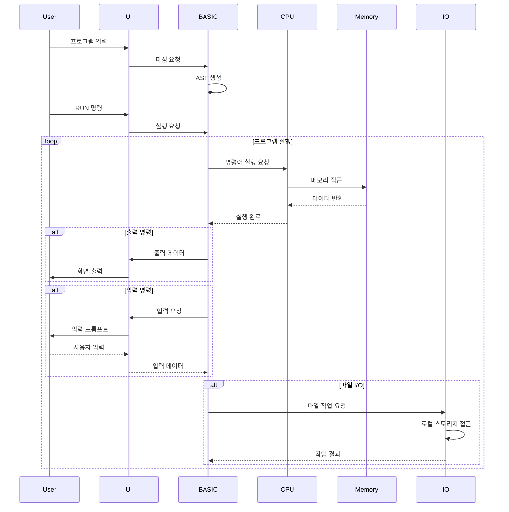

# 시스템 아키텍처 문서

> 6502 BASIC JavaScript 에뮬레이터의 전체적인 시스템 설계 및 구조

## 📋 목차

1. [아키텍처 개요](#아키텍처-개요)
2. [계층별 구조](#계층별-구조)
3. [모듈 상세 설계](#모듈-상세-설계)
4. [데이터 흐름](#데이터-흐름)
5. [상태 관리](#상태-관리)
6. [성능 고려사항](#성능-고려사항)
7. [확장성 설계](#확장성-설계)
8. [보안 고려사항](#보안-고려사항)

## 🏗️ 아키텍처 개요

### 전체 시스템 구조

```mermaid
graph TB
    subgraph "웹 브라우저 환경"
        UI[사용자 인터페이스 레이어]
        BASIC[BASIC 인터프리터 레이어]
        CPU[6502 CPU 에뮬레이션 레이어]
        MEMORY[메모리 관리 레이어]
        IO[I/O 시스템 레이어]
        MATH[수학 처리 레이어]
    end
    
    UI --> BASIC
    BASIC --> CPU
    BASIC --> MEMORY
    CPU --> MEMORY
    CPU --> MATH
    BASIC --> IO
    UI --> IO
    
    subgraph "외부 저장소"
        LOCAL[로컬 스토리지]
        SESSION[세션 스토리지]
    end
    
    IO --> LOCAL
    IO --> SESSION
```



### 핵심 설계 원칙

1. **모듈성**: 각 컴포넌트는 독립적이고 교체 가능
2. **타입 안전성**: TypeScript를 통한 컴파일 타임 오류 방지
3. **성능**: 브라우저 환경에서 실시간 실행 가능한 최적화
4. **확장성**: 새로운 기능과 플랫폼 지원 용이
5. **테스트 가능성**: 단위 테스트와 통합 테스트 지원
6. **사용자 경험**: 직관적이고 반응성 좋은 인터페이스

## 🏛️ 계층별 구조

### 1. 프레젠테이션 레이어 (UI)

**책임**: 사용자 상호작용 및 화면 표시

```typescript
interface PresentationLayer {
  components: {
    Terminal: TerminalComponent;
    Editor: EditorComponent;  
    Debugger: DebuggerComponent;
    FileManager: FileManagerComponent;
  };
  
  events: EventSystem;
  state: UIState;
}
```

**주요 컴포넌트**:
- **터미널**: BASIC 명령 실행 및 출력 표시
- **에디터**: 프로그램 작성 및 편집
- **디버거**: 실행 추적 및 변수 모니터링
- **파일 관리자**: 프로그램 저장/로드

### 2. 애플리케이션 레이어 (BASIC 인터프리터)

**책임**: BASIC 언어 처리 및 프로그램 실행 제어

```typescript
interface ApplicationLayer {
  parser: BasicParser;
  interpreter: BasicInterpreter;
  runtime: RuntimeEnvironment;
  variables: VariableManager;
  functions: FunctionLibrary;
}
```

**핵심 기능**:
- **파서**: BASIC 소스코드 → AST (추상 구문 트리)
- **인터프리터**: AST 실행 엔진
- **런타임**: 실행 컨텍스트 관리
- **변수 관리**: 메모리 할당 및 가비지 컬렉션

### 3. 에뮬레이션 레이어 (6502 CPU)

**책임**: 6502 마이크로프로세서 완전 에뮬레이션

```typescript
interface EmulationLayer {
  cpu: CPU6502;
  instructions: InstructionSet;
  addressingModes: AddressingModeManager;
  interrupts: InterruptController;
}
```

**핵심 컴포넌트**:
- **CPU 코어**: 레지스터, 플래그, 실행 파이프라인
- **명령어 세트**: 151개 6502 명령어 구현
- **주소 지정**: 13가지 주소 지정 모드
- **인터럽트**: IRQ, NMI, BRK 처리

### 4. 인프라스트럭처 레이어

**책임**: 하위 수준 시스템 서비스

```typescript
interface InfrastructureLayer {
  memory: MemoryManager;
  io: IOSystem;
  storage: StorageManager;
  events: EventEmitter;
  performance: PerformanceMonitor;
}
```

## 🔧 모듈 상세 설계

### CPU 에뮬레이터 모듈

#### 아키텍처 패턴: Command Pattern + Strategy Pattern

```typescript
// 명령어 인터페이스 (Command Pattern)
interface CPUInstruction {
  readonly opcode: number;
  readonly mnemonic: string;
  readonly cycles: number;
  readonly addressingMode: AddressingMode;
  
  execute(cpu: CPU6502): void;
}

// 주소 지정 전략 (Strategy Pattern)
interface AddressingStrategy {
  getOperandAddress(cpu: CPU6502): number;
  getOperandValue(cpu: CPU6502): number;
}

// CPU 코어 클래스
class CPU6502 {
  private readonly registers: CPURegisters;
  private readonly memory: MemoryManager;
  private readonly instructions: Map<number, CPUInstruction>;
  private readonly addressingModes: Map<AddressingMode, AddressingStrategy>;
  
  public step(): number {
    const opcode = this.fetchByte();
    const instruction = this.instructions.get(opcode);
    
    if (!instruction) {
      throw new CPUError(`Unknown opcode: 0x${opcode.toString(16)}`);
    }
    
    instruction.execute(this);
    return instruction.cycles;
  }
}
```

#### 레지스터 관리

```typescript
class CPURegisters {
  private _A: number = 0;    // 누산기
  private _X: number = 0;    // X 인덱스
  private _Y: number = 0;    // Y 인덱스  
  private _SP: number = 0xFF; // 스택 포인터
  private _PC: number = 0;    // 프로그램 카운터
  private _P: number = 0x20;  // 상태 레지스터
  
  // getter/setter with validation
  public get A(): number { return this._A; }
  public set A(value: number) { 
    this._A = this.validateByte(value);
    this.updateZeroNegativeFlags(this._A);
  }
  
  private validateByte(value: number): number {
    return value & 0xFF; // 0-255 범위로 제한
  }
  
  private updateZeroNegativeFlags(value: number): void {
    this.setFlag(CPUFlag.ZERO, value === 0);
    this.setFlag(CPUFlag.NEGATIVE, (value & 0x80) !== 0);
  }
}
```

### BASIC 인터프리터 모듈

#### 아키텍처 패턴: Interpreter Pattern + Visitor Pattern

```typescript
// AST 노드 인터페이스
interface ASTNode {
  accept<T>(visitor: ASTVisitor<T>): T;
}

// 문장 노드
class PrintStatement implements ASTNode {
  constructor(public readonly expressions: Expression[]) {}
  
  accept<T>(visitor: ASTVisitor<T>): T {
    return visitor.visitPrintStatement(this);
  }
}

// 표현식 노드
class BinaryExpression implements ASTNode {
  constructor(
    public readonly left: Expression,
    public readonly operator: BinaryOperator,
    public readonly right: Expression
  ) {}
  
  accept<T>(visitor: ASTVisitor<T>): T {
    return visitor.visitBinaryExpression(this);
  }
}

// 방문자 인터페이스 (Visitor Pattern)
interface ASTVisitor<T> {
  visitPrintStatement(node: PrintStatement): T;
  visitBinaryExpression(node: BinaryExpression): T;
  visitVariableExpression(node: VariableExpression): T;
  visitLiteralExpression(node: LiteralExpression): T;
}

// 인터프리터 방문자
class InterpreterVisitor implements ASTVisitor<BasicValue> {
  constructor(private readonly environment: Environment) {}
  
  visitPrintStatement(node: PrintStatement): BasicValue {
    const values = node.expressions.map(expr => expr.accept(this));
    const output = values.map(v => this.stringify(v)).join(' ');
    this.environment.output(output);
    return null;
  }
  
  visitBinaryExpression(node: BinaryExpression): BasicValue {
    const left = node.left.accept(this);
    const right = node.right.accept(this);
    return this.evaluateBinaryOperation(left, node.operator, right);
  }
}
```

#### 파서 설계 (Recursive Descent Parser)

```typescript
class BasicParser {
  private tokens: Token[];
  private current: number = 0;
  
  public parse(source: string): Program {
    this.tokens = this.tokenize(source);
    this.current = 0;
    
    const lines: ProgramLine[] = [];
    while (!this.isAtEnd()) {
      lines.push(this.parseLine());
    }
    
    return new Program(lines);
  }
  
  private parseLine(): ProgramLine {
    const lineNumber = this.consumeNumber();
    const statement = this.parseStatement();
    return new ProgramLine(lineNumber, statement);
  }
  
  private parseStatement(): Statement {
    if (this.match('PRINT')) return this.parsePrintStatement();
    if (this.match('LET')) return this.parseLetStatement();
    if (this.match('IF')) return this.parseIfStatement();
    if (this.match('FOR')) return this.parseForStatement();
    if (this.match('GOTO')) return this.parseGotoStatement();
    
    throw new ParseError('Unexpected token: ' + this.peek().lexeme);
  }
  
  private parsePrintStatement(): PrintStatement {
    const expressions: Expression[] = [];
    
    do {
      expressions.push(this.parseExpression());
    } while (this.match(',', ';'));
    
    return new PrintStatement(expressions);
  }
  
  private parseExpression(): Expression {
    return this.parseLogicalOr();
  }
  
  private parseLogicalOr(): Expression {
    let expr = this.parseLogicalAnd();
    
    while (this.match('OR')) {
      const operator = this.previous();
      const right = this.parseLogicalAnd();
      expr = new BinaryExpression(expr, operator.type, right);
    }
    
    return expr;
  }
}
```

### 메모리 관리 모듈

#### 아키텍처 패턴: Strategy Pattern + Observer Pattern

```typescript
// 메모리 전략 인터페이스
interface MemoryStrategy {
  read(address: number): number;
  write(address: number, value: number): void;
}

// 기본 RAM 전략
class RAMStrategy implements MemoryStrategy {
  private readonly data: Uint8Array;
  
  constructor(size: number) {
    this.data = new Uint8Array(size);
  }
  
  read(address: number): number {
    return this.data[address];
  }
  
  write(address: number, value: number): void {
    this.data[address] = value & 0xFF;
  }
}

// ROM 전략 (읽기 전용)
class ROMStrategy implements MemoryStrategy {
  private readonly data: Uint8Array;
  
  constructor(data: Uint8Array) {
    this.data = new Uint8Array(data);
  }
  
  read(address: number): number {
    return this.data[address];
  }
  
  write(address: number, value: number): void {
    // ROM은 쓰기 불가 - 무시하거나 에러 발생
    console.warn(`Attempt to write to ROM address 0x${address.toString(16)}`);
  }
}

// 메모리 관리자 (Observer Pattern)
class MemoryManager extends EventEmitter<MemoryEvents> {
  private readonly banks: Map<number, MemoryStrategy>;
  private readonly watchers: Set<MemoryWatcher>;
  
  constructor() {
    super();
    this.banks = new Map();
    this.watchers = new Set();
    this.initializeDefaultBanks();
  }
  
  public read(address: number): number {
    const bank = this.getBank(address);
    const value = bank.read(address);
    
    // 메모리 읽기 이벤트 발생
    this.emit('read', { address, value });
    
    // 워처에게 알림
    this.notifyWatchers('read', address, value);
    
    return value;
  }
  
  public write(address: number, value: number): void {
    const bank = this.getBank(address);
    bank.write(address, value);
    
    // 메모리 쓰기 이벤트 발생
    this.emit('write', { address, value });
    
    // 워처에게 알림
    this.notifyWatchers('write', address, value);
  }
  
  private getBank(address: number): MemoryStrategy {
    const bankId = Math.floor(address / 0x1000); // 4KB 뱅크
    return this.banks.get(bankId) || this.banks.get(0)!;
  }
}
```

#### 가비지 컬렉션 (문자열 메모리)

```typescript
class StringGarbageCollector {
  private readonly heap: StringHeap;
  private readonly roots: Set<StringReference>;
  
  constructor(heap: StringHeap) {
    this.heap = heap;
    this.roots = new Set();
  }
  
  public collect(): GCStats {
    const startTime = performance.now();
    const initialMemory = this.heap.getUsedMemory();
    
    // Mark phase: 도달 가능한 문자열 마킹
    const marked = this.mark();
    
    // Sweep phase: 마킹되지 않은 문자열 해제
    const freed = this.sweep(marked);
    
    // Compact phase: 메모리 압축 (선택적)
    if (this.shouldCompact()) {
      this.compact();
    }
    
    return {
      duration: performance.now() - startTime,
      freedMemory: freed,
      totalMemory: this.heap.getTotalMemory(),
      usedMemory: this.heap.getUsedMemory()
    };
  }
  
  private mark(): Set<StringReference> {
    const marked = new Set<StringReference>();
    const stack: StringReference[] = Array.from(this.roots);
    
    while (stack.length > 0) {
      const ref = stack.pop()!;
      if (marked.has(ref)) continue;
      
      marked.add(ref);
      
      // 참조하는 다른 문자열들을 스택에 추가
      const references = this.heap.getReferences(ref);
      stack.push(...references);
    }
    
    return marked;
  }
  
  private sweep(marked: Set<StringReference>): number {
    let freedMemory = 0;
    
    for (const ref of this.heap.getAllReferences()) {
      if (!marked.has(ref)) {
        freedMemory += this.heap.getSize(ref);
        this.heap.free(ref);
      }
    }
    
    return freedMemory;
  }
}
```

### I/O 시스템 모듈

#### 아키텍처 패턴: Command Pattern + Chain of Responsibility

```typescript
// I/O 명령 인터페이스
interface IOCommand {
  execute(): Promise<IOResult>;
  canUndo(): boolean;
  undo(): Promise<void>;
}

// 파일 로드 명령
class LoadFileCommand implements IOCommand {
  constructor(
    private readonly filename: string,
    private readonly storage: StorageManager
  ) {}
  
  async execute(): Promise<IOResult> {
    try {
      const content = await this.storage.load(this.filename);
      return { success: true, data: content };
    } catch (error) {
      return { success: false, error: error.message };
    }
  }
  
  canUndo(): boolean {
    return false; // 파일 로드는 언두 불가
  }
  
  async undo(): Promise<void> {
    throw new Error('Cannot undo file load operation');
  }
}

// I/O 핸들러 체인
abstract class IOHandler {
  protected next?: IOHandler;
  
  public setNext(handler: IOHandler): IOHandler {
    this.next = handler;
    return handler;
  }
  
  public async handle(request: IORequest): Promise<IOResult> {
    if (this.canHandle(request)) {
      return this.process(request);
    } else if (this.next) {
      return this.next.handle(request);
    } else {
      throw new Error(`No handler found for request type: ${request.type}`);
    }
  }
  
  protected abstract canHandle(request: IORequest): boolean;
  protected abstract process(request: IORequest): Promise<IOResult>;
}

// 로컬 스토리지 핸들러
class LocalStorageHandler extends IOHandler {
  protected canHandle(request: IORequest): boolean {
    return request.type === 'localStorage';
  }
  
  protected async process(request: IORequest): Promise<IOResult> {
    switch (request.operation) {
      case 'save':
        localStorage.setItem(request.key, request.data);
        return { success: true };
        
      case 'load':
        const data = localStorage.getItem(request.key);
        return { success: true, data };
        
      case 'delete':
        localStorage.removeItem(request.key);
        return { success: true };
        
      default:
        return { success: false, error: 'Unknown operation' };
    }
  }
}
```

## 📊 데이터 흐름

### 전체 데이터 흐름 다이어그램



### 명령어 실행 흐름

```typescript
// BASIC 명령어 실행 플로우
class BasicInterpreter {
  public async executeProgram(program: Program): Promise<ExecutionResult> {
    try {
      // 1. 초기화
      this.runtime.initialize();
      this.variables.clear();
      
      // 2. 프로그램 라인별 실행
      for (const line of program.lines) {
        await this.executeLine(line);
        
        // 3. 제어 흐름 확인
        if (this.runtime.shouldStop()) break;
        if (this.runtime.shouldJump()) {
          const targetLine = this.runtime.getJumpTarget();
          this.runtime.setCurrentLine(targetLine);
        }
      }
      
      return { success: true, output: this.runtime.getOutput() };
      
    } catch (error) {
      return { 
        success: false, 
        error: error.message,
        line: this.runtime.getCurrentLine()
      };
    }
  }
  
  private async executeLine(line: ProgramLine): Promise<void> {
    this.runtime.setCurrentLine(line.lineNumber);
    
    // 4. 명령문 타입별 처리
    switch (line.statement.type) {
      case 'PRINT':
        await this.executePrint(line.statement as PrintStatement);
        break;
      case 'LET':
        await this.executeLet(line.statement as LetStatement);
        break;
      case 'IF':
        await this.executeIf(line.statement as IfStatement);
        break;
      // ... 다른 명령문들
    }
  }
}
```

## 🗄️ 상태 관리

### 상태 관리 아키텍처

```typescript
// 중앙 상태 저장소 (Redux-like 패턴)
interface AppState {
  cpu: CPUState;
  basic: BasicState;
  ui: UIState;
  io: IOState;
  debug: DebugState;
}

// 상태 액션
type AppAction = 
  | CPUAction
  | BasicAction  
  | UIAction
  | IOAction
  | DebugAction;

// 상태 리듀서
class StateManager {
  private state: AppState;
  private listeners: Set<StateListener>;
  
  constructor(initialState: AppState) {
    this.state = initialState;
    this.listeners = new Set();
  }
  
  public dispatch(action: AppAction): void {
    const newState = this.reduce(this.state, action);
    
    if (newState !== this.state) {
      this.state = newState;
      this.notifyListeners();
    }
  }
  
  public getState(): AppState {
    return this.state;
  }
  
  public subscribe(listener: StateListener): () => void {
    this.listeners.add(listener);
    return () => this.listeners.delete(listener);
  }
  
  private reduce(state: AppState, action: AppAction): AppState {
    switch (action.type) {
      case 'CPU_RESET':
        return {
          ...state,
          cpu: this.cpuReducer(state.cpu, action)
        };
        
      case 'BASIC_PROGRAM_LOAD':
        return {
          ...state,
          basic: this.basicReducer(state.basic, action)
        };
        
      default:
        return state;
    }
  }
}
```

### CPU 상태 관리

```typescript
interface CPUState {
  registers: {
    A: number;
    X: number;
    Y: number;
    SP: number;
    PC: number;
    P: number;
  };
  flags: {
    carry: boolean;
    zero: boolean;
    interrupt: boolean;
    decimal: boolean;
    break: boolean;
    overflow: boolean;
    negative: boolean;
  };
  cycleCount: number;
  instructionCount: number;
  isRunning: boolean;
  breakpoints: Set<number>;
}

class CPUStateManager {
  public static fromCPU(cpu: CPU6502): CPUState {
    return {
      registers: {
        A: cpu.registers.A,
        X: cpu.registers.X,
        Y: cpu.registers.Y,
        SP: cpu.registers.SP,
        PC: cpu.registers.PC,
        P: cpu.registers.P
      },
      flags: {
        carry: cpu.getFlag(CPUFlag.CARRY),
        zero: cpu.getFlag(CPUFlag.ZERO),
        interrupt: cpu.getFlag(CPUFlag.INTERRUPT),
        decimal: cpu.getFlag(CPUFlag.DECIMAL),
        break: cpu.getFlag(CPUFlag.BREAK),
        overflow: cpu.getFlag(CPUFlag.OVERFLOW),
        negative: cpu.getFlag(CPUFlag.NEGATIVE)
      },
      cycleCount: cpu.getCycleCount(),
      instructionCount: cpu.getInstructionCount(),
      isRunning: cpu.isRunning(),
      breakpoints: new Set(cpu.getBreakpoints())
    };
  }
}
```

## ⚡ 성능 고려사항

### 최적화 전략

#### 1. CPU 에뮬레이션 최적화

```typescript
class OptimizedCPU6502 extends CPU6502 {
  // 명령어 캐싱
  private instructionCache = new Map<number, CPUInstruction>();
  
  // 주소 계산 캐싱
  private addressCache = new Map<string, number>();
  
  // 핫스팟 감지
  private hotspots = new Map<number, number>();
  
  public step(): number {
    const pc = this.registers.PC;
    
    // 핫스팟 업데이트
    this.hotspots.set(pc, (this.hotspots.get(pc) || 0) + 1);
    
    // 캐시된 명령어 사용
    const opcode = this.memory.read(pc);
    let instruction = this.instructionCache.get(opcode);
    
    if (!instruction) {
      instruction = this.opcodes[opcode];
      this.instructionCache.set(opcode, instruction);
    }
    
    // JIT 컴파일 고려 (핫스팟)
    if (this.hotspots.get(pc)! > 100) {
      this.considerJITCompilation(pc);
    }
    
    instruction.execute(this);
    return instruction.cycles;
  }
  
  private considerJITCompilation(address: number): void {
    // 자주 실행되는 코드 블록을 JavaScript로 컴파일
    // (실제 구현에서는 더 복잡한 분석 필요)
    const codeBlock = this.analyzeCodeBlock(address);
    if (codeBlock.isCompilable) {
      this.compileToJS(codeBlock);
    }
  }
}
```

#### 2. 메모리 접근 최적화

```typescript
class OptimizedMemoryManager extends MemoryManager {
  // 페이지 단위 캐싱
  private pageCache = new Map<number, Uint8Array>();
  
  // 더티 페이지 추적
  private dirtyPages = new Set<number>();
  
  public read(address: number): number {
    const pageNum = address >>> 8; // 페이지 번호 (상위 8비트)
    const offset = address & 0xFF; // 페이지 내 오프셋
    
    let page = this.pageCache.get(pageNum);
    if (!page) {
      page = this.loadPage(pageNum);
      this.pageCache.set(pageNum, page);
    }
    
    return page[offset];
  }
  
  public write(address: number, value: number): void {
    const pageNum = address >>> 8;
    const offset = address & 0xFF;
    
    let page = this.pageCache.get(pageNum);
    if (!page) {
      page = this.loadPage(pageNum);
      this.pageCache.set(pageNum, page);
    }
    
    page[offset] = value & 0xFF;
    this.dirtyPages.add(pageNum);
    
    // 주기적으로 더티 페이지 플러시
    if (this.dirtyPages.size > 16) {
      this.flushDirtyPages();
    }
  }
  
  private loadPage(pageNum: number): Uint8Array {
    const page = new Uint8Array(256);
    const baseAddress = pageNum << 8;
    
    for (let i = 0; i < 256; i++) {
      page[i] = this.memory[baseAddress + i] || 0;
    }
    
    return page;
  }
}
```

#### 3. BASIC 인터프리터 최적화

```typescript
class OptimizedBasicInterpreter extends BasicInterpreter {
  // 표현식 캐싱
  private expressionCache = new Map<string, CompiledExpression>();
  
  // 변수 접근 최적화
  private variableIndex = new Map<string, number>();
  private variableArray: BasicValue[] = [];
  
  public evaluateExpression(expr: Expression): BasicValue {
    const exprKey = this.getExpressionKey(expr);
    
    // 캐시된 컴파일된 표현식 사용
    let compiled = this.expressionCache.get(exprKey);
    if (!compiled) {
      compiled = this.compileExpression(expr);
      this.expressionCache.set(exprKey, compiled);
    }
    
    return compiled.evaluate(this.variableArray);
  }
  
  private compileExpression(expr: Expression): CompiledExpression {
    // BASIC 표현식을 JavaScript 함수로 컴파일
    const jsCode = this.generateJS(expr);
    const func = new Function('vars', `return ${jsCode}`);
    
    return {
      evaluate: func,
      dependencies: this.extractDependencies(expr)
    };
  }
  
  public setVariable(name: string, value: BasicValue): void {
    let index = this.variableIndex.get(name);
    if (index === undefined) {
      index = this.variableArray.length;
      this.variableIndex.set(name, index);
      this.variableArray.push(value);
    } else {
      this.variableArray[index] = value;
    }
    
    // 의존성이 있는 캐시된 표현식 무효화
    this.invalidateExpressionCache(name);
  }
}
```

### 성능 모니터링

```typescript
class PerformanceProfiler {
  private metrics: Map<string, PerformanceMetric> = new Map();
  
  public startTimer(name: string): void {
    this.metrics.set(name, {
      startTime: performance.now(),
      endTime: 0,
      duration: 0,
      callCount: (this.metrics.get(name)?.callCount || 0) + 1
    });
  }
  
  public endTimer(name: string): number {
    const metric = this.metrics.get(name);
    if (!metric) return 0;
    
    metric.endTime = performance.now();
    metric.duration = metric.endTime - metric.startTime;
    
    return metric.duration;
  }
  
  public getReport(): PerformanceReport {
    const report: PerformanceReport = {
      totalTime: 0,
      breakdown: new Map()
    };
    
    for (const [name, metric] of this.metrics) {
      report.breakdown.set(name, {
        totalTime: metric.duration * metric.callCount,
        averageTime: metric.duration / metric.callCount,
        callCount: metric.callCount
      });
      
      report.totalTime += metric.duration * metric.callCount;
    }
    
    return report;
  }
}
```

## 🔄 확장성 설계

### 플러그인 아키텍처

```typescript
interface Plugin {
  readonly name: string;
  readonly version: string;
  readonly dependencies: string[];
  
  initialize(context: PluginContext): Promise<void>;
  destroy(): Promise<void>;
}

interface PluginContext {
  cpu: CPU6502;
  interpreter: BasicInterpreter;
  ui: UIManager;
  eventBus: EventBus;
}

class PluginManager {
  private plugins = new Map<string, Plugin>();
  private loadedPlugins = new Set<string>();
  
  public async loadPlugin(plugin: Plugin): Promise<void> {
    // 의존성 확인
    for (const dep of plugin.dependencies) {
      if (!this.loadedPlugins.has(dep)) {
        throw new PluginError(`Dependency not found: ${dep}`);
      }
    }
    
    // 플러그인 초기화
    const context = this.createPluginContext();
    await plugin.initialize(context);
    
    this.plugins.set(plugin.name, plugin);
    this.loadedPlugins.add(plugin.name);
  }
  
  public async unloadPlugin(name: string): Promise<void> {
    const plugin = this.plugins.get(name);
    if (!plugin) return;
    
    // 의존성 확인 (다른 플러그인이 의존하고 있는지)
    for (const [, otherPlugin] of this.plugins) {
      if (otherPlugin.dependencies.includes(name)) {
        throw new PluginError(`Cannot unload ${name}: still has dependents`);
      }
    }
    
    await plugin.destroy();
    this.plugins.delete(name);
    this.loadedPlugins.delete(name);
  }
}
```

### 다중 플랫폼 지원

```typescript
// 플랫폼별 추상화
interface PlatformAdapter {
  readonly name: string;
  readonly memoryLayout: MemoryLayout;
  readonly ioMapping: IOMapping;
  
  initialize(): void;
  handleInterrupt(type: InterruptType): void;
  getSystemInfo(): SystemInfo;
}

// Apple II 플랫폼
class Apple2Adapter implements PlatformAdapter {
  readonly name = 'Apple II';
  readonly memoryLayout = {
    textPage: 0x400,
    hires: 0x2000,
    rom: 0xD000
  };
  readonly ioMapping = {
    keyboard: 0xC000,
    speaker: 0xC030,
    graphics: 0xC050
  };
  
  initialize(): void {
    // Apple II 특화 초기화
    this.setupTextMode();
    this.initializeKeyboard();
  }
  
  handleInterrupt(type: InterruptType): void {
    // Apple II 인터럽트 처리
  }
}

// 플랫폼 관리자
class PlatformManager {
  private currentAdapter?: PlatformAdapter;
  private adapters = new Map<string, PlatformAdapter>();
  
  public registerAdapter(adapter: PlatformAdapter): void {
    this.adapters.set(adapter.name, adapter);
  }
  
  public switchPlatform(name: string): void {
    const adapter = this.adapters.get(name);
    if (!adapter) {
      throw new Error(`Unknown platform: ${name}`);
    }
    
    if (this.currentAdapter) {
      // 현재 플랫폼 정리
    }
    
    this.currentAdapter = adapter;
    adapter.initialize();
    
    // CPU와 메모리 재구성
    this.reconfigureSystem(adapter);
  }
}
```

## 🛡️ 보안 고려사항

### 메모리 보호

```typescript
class SecureMemoryManager extends MemoryManager {
  private readonly protectedRanges: MemoryRange[] = [];
  private readonly readOnlyRanges: MemoryRange[] = [];
  
  public addProtectedRange(start: number, end: number): void {
    this.protectedRanges.push({ start, end });
  }
  
  public addReadOnlyRange(start: number, end: number): void {
    this.readOnlyRanges.push({ start, end });
  }
  
  public write(address: number, value: number): void {
    // 보호된 메모리 영역 확인
    for (const range of this.protectedRanges) {
      if (address >= range.start && address <= range.end) {
        throw new MemoryProtectionError(
          `Access denied to protected memory at 0x${address.toString(16)}`
        );
      }
    }
    
    // 읽기 전용 영역 확인
    for (const range of this.readOnlyRanges) {
      if (address >= range.start && address <= range.end) {
        throw new MemoryProtectionError(
          `Attempt to write to read-only memory at 0x${address.toString(16)}`
        );
      }
    }
    
    super.write(address, value);
  }
}
```

### 입력 검증

```typescript
class InputValidator {
  public static validateBasicLine(line: string): ValidationResult {
    // 길이 제한
    if (line.length > MAX_LINE_LENGTH) {
      return { valid: false, error: 'Line too long' };
    }
    
    // 위험한 패턴 검사
    const dangerousPatterns = [
      /eval\s*\(/i,
      /function\s*\(/i,
      /<script/i,
      /javascript:/i
    ];
    
    for (const pattern of dangerousPatterns) {
      if (pattern.test(line)) {
        return { valid: false, error: 'Potentially unsafe content detected' };
      }
    }
    
    return { valid: true };
  }
  
  public static sanitizeFilename(filename: string): string {
    // 경로 순회 방지
    return filename
      .replace(/[\/\\]/g, '') // 경로 구분자 제거
      .replace(/\.\./g, '')   // 상위 디렉토리 참조 제거
      .replace(/[<>:"|?*]/g, '') // 특수 문자 제거
      .substring(0, 255);     // 길이 제한
  }
}
```

### 샌드박스 실행

```typescript
class SandboxedInterpreter extends BasicInterpreter {
  private readonly maxExecutionTime = 30000; // 30초
  private readonly maxMemoryUsage = 50 * 1024 * 1024; // 50MB
  private executionStartTime = 0;
  
  public async executeProgram(program: Program): Promise<ExecutionResult> {
    this.executionStartTime = performance.now();
    
    // 실행 시간 모니터링
    const timeoutId = setTimeout(() => {
      throw new ExecutionTimeoutError('Program execution timeout');
    }, this.maxExecutionTime);
    
    try {
      // 메모리 사용량 모니터링
      this.startMemoryMonitoring();
      
      const result = await super.executeProgram(program);
      
      clearTimeout(timeoutId);
      return result;
      
    } catch (error) {
      clearTimeout(timeoutId);
      throw error;
    }
  }
  
  private startMemoryMonitoring(): void {
    const checkMemory = () => {
      const memoryUsage = this.getMemoryUsage();
      if (memoryUsage > this.maxMemoryUsage) {
        throw new MemoryLimitError('Memory usage limit exceeded');
      }
      
      if (performance.now() - this.executionStartTime < this.maxExecutionTime) {
        setTimeout(checkMemory, 1000); // 1초마다 확인
      }
    };
    
    setTimeout(checkMemory, 1000);
  }
}
```

이 아키텍처 문서를 통해 6502 BASIC JavaScript 에뮬레이터의 전체적인 구조와 설계 철학을 이해하고, 각 모듈 간의 상호작용과 확장 방법을 파악할 수 있습니다.